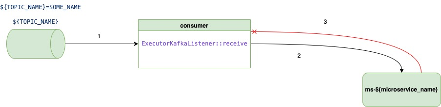
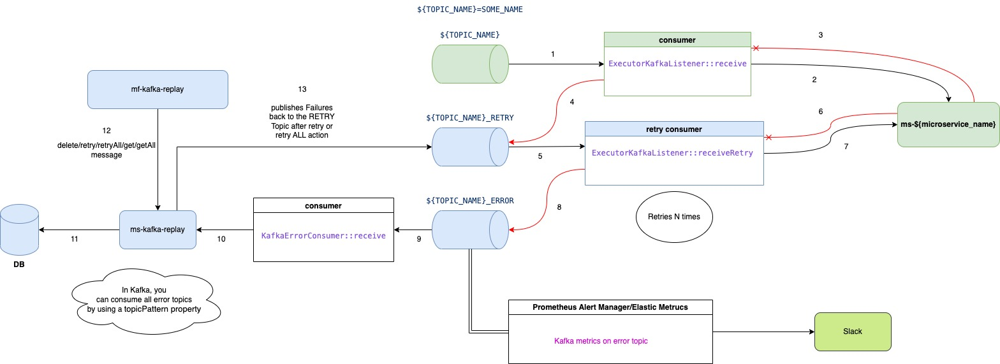
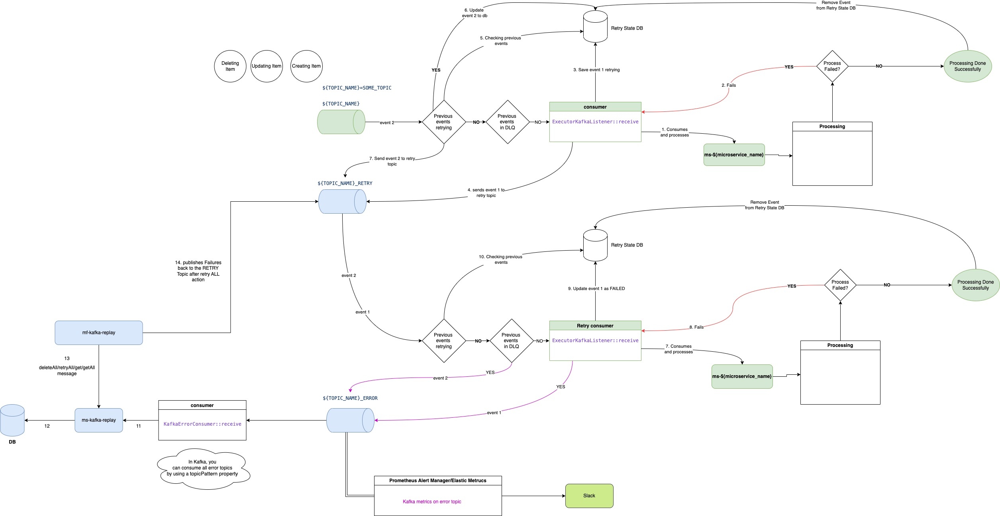

# Kafka Replay
As a-lot of our micro-services are designed using event driven architecture, we need to make sure that we are handling the failures correctly 
and how do we make sure that we have a fall back mechanism to retry them later. Most of us in design, we are doing forget and proceed 
if a message has failed a couple of times. This requires some developer’s time to investigate and then invoke a manual endpoint to retry the exact message. 
The main focus of the proposal is how we can solve this problem and improve error observability using a retry and replay pattern.
We are going to avoid any Framework solutions like Axon for Event Sourcing regarding Kafka Retry as it might be different between languages like 
Python, GoLang, Java, Kotlin etc.



## Not Maintaining Order Non Blocking Retries

This pattern would allow the main topic for a consumer group to be not blocked whilst it gets retried. Any failures would be placed in the retry topic
and then would retry couple of times before landing onto the Error/ Dead Letter Topic. As we have messages that could not be processed onto the Dead Letter Topic, 
we can use it to investigate the messages and then replay them later using a UI or Endpoints.



1. micro-service consumes from the main topic 
2. micro-service processes and runs business logic 
3. failed to process the message 
4. as it failed, it pushes back to Retry Topic 
5. micro-service consumes from the Retry topic 
6. micro-service processes and runs business logic 
7. failed to process the message and Retries couple of times 
8. If it still fails, it lands to Dead Letter/Error Topic 
9. Consumes failed event by ms-kafka-replay 
10. Process and runs some business logic on the failed events 
11. Saves the failed event to Failed Messages DB. The model looks something like:
```
{
  "_id": {
    "partition": NumberInt(1),
    "offset": NumberLong(27),
    "topic": "maintaining-order-event_ms-kafka-failure_RETRY"
  },
  "orderingRequired": "ORDERED", // UNORDERED, ORDERED => This identifies whether this message requires to maintain order when we publish to retry topic
  "topic": "maintaining-order-event_ms-kafka-failure_RETRY",
  "key": "{\"name\":\"tester\"}",
  "payload": "eyJldmVudFR5cGUiOiJVUERBVEVEIiwicHJvdmlkZXJfaWQiOjI3MSwiY2xpZW50cyI6W3sieXRyZWVfY2xpZW50X2lkIjoiNTZiNWY0ZTEtMDk5YS00ZjczLTk1YWYtOTZiZGExNjZhYWZiIiwiY2xpZW50X2lkIjoiOGIwMTQ4NjctNDUwNC00YzIxLWIyODYtY2I5MWEwNmI2MWVjIiwiYWNjb3VudHMiOlt7Im51bWJlciI6IjcwMDgyMjYxIiwidHlwZSI6IkNVUlJFTlRfQUNDT1VOVCIsInN0YXRlbWVudF9kYXRlIjoiMjAyMi0wOS0xMyIsImN1cnJlbmN5IjoiR0JQIiwiYmFsYW5jZSI6MjMzLjYzLCJ0cmFuc2FjdGlvbnMiOlt7InR5cGUiOiJERVBPU0lUIiwiZGF0ZSI6IjIwMjItMDgtMzEiLCJhbW91bnQiOjAuOTYsImN1cnJlbmN5IjoiR0JQIiwiZGVzY3JpcHRpb24iOiJTdGFybGluZyBCYW5rIiwiaWQiOiJhYmE4OWUwOS1mOTQxLTQ2NjctYTg5Yi00YjlhMGE4NWI0YjMifV0sInNvdXJjZSI6IllBUElMWSIsImV4dGVybmFsU291cmNlIjoiT1BFTl9CQU5LSU5HIiwiZXh0ZXJuYWxJZCI6IjRkNmIyOGVlLTkwNmYtNDQ5ZC05ZTMxLTdhMjJhMzNkMjM4OSJ9XX1dLCJzb3VyY2UiOiJZQVBJTFkifQ==",
  "exceptionStacktrace": "org.springframework.kafka.listener.ListenerExecutionFailedException: Listener method 'public void com.ak.ms.kafkafailure.kafka.consumer.MaintainingOrderKafkaConsumer.onOrderRetryEvent(org.apache.kafka.clients.consumer.ConsumerRecord<java.lang.String, java.lang.String>,java.lang.String)' threw exception\n\tat org.springframework.kafka.listener.KafkaMessageListenerContainer$ListenerConsumer.decorateException(KafkaMessageListenerContainer.java:2928)\n\tat org.springframework.kafka.listener.KafkaMessageListenerContainer$ListenerConsumer.doInvokeOnMessage(KafkaMessageListenerContainer.java:2879)\n\tat org.springframework.kafka.listener.KafkaMessageListenerContainer$ListenerConsumer.invokeOnMessage(KafkaMessageListenerContainer.java:2839)\n\tat org.springframework.kafka.listener.KafkaMessageListenerContainer$ListenerConsumer.lambda$doInvokeRecordListener$56(KafkaMessageListenerContainer.java:2762)\n\tat io.micrometer.observation.Observation.observe(Observation.java:559)\n\tat org.springframework.kafka.listener.KafkaMessageListenerContainer$ListenerConsumer.doInvokeRecordListener(KafkaMessageListenerContainer.java:2760)\n\tat org.springframework.kafka.listener.KafkaMessageListenerContainer$ListenerConsumer.doInvokeWithRecords(KafkaMessageListenerContainer.java:2612)\n\tat org.springframework.kafka.listener.KafkaMessageListenerContainer$ListenerConsumer.invokeRecordListener(KafkaMessageListenerContainer.java:2498)\n\tat org.springframework.kafka.listener.KafkaMessageListenerContainer$ListenerConsumer.invokeListener(KafkaMessageListenerContainer.java:2144)\n\tat org.springframework.kafka.listener.KafkaMessageListenerContainer$ListenerConsumer.invokeIfHaveRecords(KafkaMessageListenerContainer.java:1499)\n\tat org.springframework.kafka.listener.KafkaMessageListenerContainer$ListenerConsumer.pollAndInvoke(KafkaMessageListenerContainer.java:1463)\n\tat org.springframework.kafka.listener.KafkaMessageListenerContainer$ListenerConsumer.run(KafkaMessageListenerContainer.java:1338)\n\tat java.base/java.util.concurrent.CompletableFuture$AsyncRun.run(CompletableFuture.java:1804)\n\tat java.base/java.lang.Thread.run(Thread.java:833)\n\tSuppressed: org.springframework.kafka.listener.ListenerExecutionFailedException: Restored Stack Trace\n\t\tat org.springframework.kafka.listener.adapter.MessagingMessageListenerAdapter.invokeHandler(MessagingMessageListenerAdapter.java:382)\n\t\tat org.springframework.kafka.listener.adapter.RecordMessagingMessageListenerAdapter.onMessage(RecordMessagingMessageListenerAdapter.java:92)\n\t\tat org.springframework.kafka.listener.adapter.RecordMessagingMessageListenerAdapter.onMessage(RecordMessagingMessageListenerAdapter.java:53)\n\t\tat org.springframework.kafka.listener.KafkaMessageListenerContainer$ListenerConsumer.doInvokeOnMessage(KafkaMessageListenerContainer.java:2859)\nCaused by: java.lang.RuntimeException: Simulating Error for key: {\"name\":\"tester\"}\n\tat com.ak.ms.kafkafailure.kafka.consumer.MaintainingOrderKafkaConsumer.processEvent(MaintainingOrderKafkaConsumer.kt:44)\n\tat com.ak.ms.kafkafailure.kafka.consumer.AbstractMaintainingOrderKafkaHandler.handleEvent(AbstractMaintaingOrderKafkaHandler.kt:36)\n\tat com.ak.ms.kafkafailure.kafka.consumer.MaintainingOrderKafkaConsumer.onOrderRetryEvent(MaintainingOrderKafkaConsumer.kt:34)\n\tat java.base/jdk.internal.reflect.NativeMethodAccessorImpl.invoke0(Native Method)\n\tat java.base/jdk.internal.reflect.NativeMethodAccessorImpl.invoke(NativeMethodAccessorImpl.java:77)\n\tat java.base/jdk.internal.reflect.DelegatingMethodAccessorImpl.invoke(DelegatingMethodAccessorImpl.java:43)\n\tat java.base/java.lang.reflect.Method.invoke(Method.java:568)\n\tat org.springframework.messaging.handler.invocation.InvocableHandlerMethod.doInvoke(InvocableHandlerMethod.java:169)\n\tat org.springframework.messaging.handler.invocation.InvocableHandlerMethod.invoke(InvocableHandlerMethod.java:119)\n\tat org.springframework.kafka.listener.adapter.HandlerAdapter.invoke(HandlerAdapter.java:56)\n\tat org.springframework.kafka.listener.adapter.MessagingMessageListenerAdapter.invokeHandler(MessagingMessageListenerAdapter.java:366)\n\tat org.springframework.kafka.listener.adapter.RecordMessagingMessageListenerAdapter.onMessage(RecordMessagingMessageListenerAdapter.java:92)\n\tat org.springframework.kafka.listener.adapter.RecordMessagingMessageListenerAdapter.onMessage(RecordMessagingMessageListenerAdapter.java:53)\n\tat org.springframework.kafka.listener.KafkaMessageListenerContainer$ListenerConsumer.doInvokeOnMessage(KafkaMessageListenerContainer.java:2859)\n\t... 12 more\n",
  "headers": {
    "kafka_original-offset": BinData(0,
    "Mjc="),
    "kafka_dlt-original-consumer-group": BinData(0,
    "bXMta2Fma2EtZmFpbHVyZQ=="),
    "kafka_dlt-original-topic": BinData(0,
    "bWFpbnRhaW5pbmctb3JkZXItZXZlbnRf.. 22 more bytes"),
    "kafka_dlt-original-offset": BinData(0,
    "AAAAAAAAACg="),
    "RETRYING_ORDER": BinData(0,
    "U09SVEVE"),
    "RETYRING_ATTEMPT": BinData(0,
    "U09SVEVE"),
    "kafka_original-partition": BinData(0,
    "MQ=="),
    "kafka_dlt-original-partition": BinData(0,
    "AAAAAQ=="),
    "traceparent": BinData(0,
    "MDAtNjNiNTc0ZjI5OTAzNjgxNDgxNzE5.. 31 more bytes"),
    "RETRYING_REFERENCE_ID": BinData(0,
    "MToyNw=="),
    "kafka_dlt-original-timestamp-type": BinData(0,
    "Q3JlYXRlVGltZQ=="),
    "kafka_dlt-original-timestamp": BinData(0,
    "AAABhXzQ01Q="),
    "kafka_dlt-exception-fqcn": BinData(0,
    "b3JnLnNwcmluZ2ZyYW1ld29yay5rYWZr.. 43 more bytes"),
    "kafka_dlt-exception-cause-fqcn": BinData(0,
    "amF2YS5sYW5nLlJ1bnRpbWVFeGNlcHRp.. 2 more bytes"),
    "kafka_dlt-exception-message": BinData(0,
    "TGlzdGVuZXIgbWV0aG9kICdwdWJsaWMg.. 210 more bytes"),
    "kafka_dlt-exception-stacktrace": BinData(0,
    "b3JnLnNwcmluZ2ZyYW1ld29yay5rYWZr.. 4494 more bytes")
  },
  "_class": "com.kafkareplay.adapter.driven.repository.kafkareplay.mongo.KafkaReplayEntity"
}
```
12. Using mf-kafka-replay UI tool to interact with the micro-service to display the  failed, delete, Retry and Retry all 
13. Publishes the failures back to the retry topic 
14. We would need to implement an alert so that it tells us to look at kafka replay tool for a topic using prometheus or Elastic Metrics

### Advantages:

- We can be adjust the architecture and add more retry topics for individual intervals such as 30s, 60s, 90s `(${TOPIC_NAME}__${SERVICE_NAME}__RETRY_30S, ${TOPIC_NAME}__${SERVICE_NAME}__RETRY_90S)` so that they can retry after certain individual intervals before landing onto the Dead Letter Topics. However, if you are adding delayed topics, you have to make sure you that max.poll.interval.ms and few other kafka consumer setting is set appropriately enough otherwise you would have same events going on a loop without being acknowledged as it did not acknowledge a number of records in that interval time because somewhere  it was taking time. 
- Common Library can be created to set up configuration for consumers and Retry and Error Topics 
- As each micro-services have individual Retry and Error topics, this would avoid having to receive duplicate messages and handle cases for that 
- Its non blocking which means that main topic is not blocked whilst retrying and can proceed on to the next message 
- We have a Dead Letter Topic and we can use it for investigations and also can be used for any functional and non-functional requirements 
- As we need a UI, we can display the exception stack trace, original position of the message from the main topic, message payload etc. 
- Architecture is Flexible as long as we have a Dead Letter Topic 
- As long as we can do any kafka health checks added onto our applications, we can make our application stop consuming or producing to kafka topics. Until it's healthy, applications are back online.

### Disadvantages

- Does not work for when we want to maintain orders of retry events therefore requires a different architecture. If Event 1 fails to create Financial Data then we shouldn't allow to retry Event 2 where it updates. Example:
  - Event 1: Create Financial Data for Client A 
  - Event 2: Update Financial Data For Client A 
  - Event 3: Delete Financial Data For Client A
- Expensive as we are expanding more Kafka Topics which also means we need more resources for Kafka

## Maintaining Order Non Blocking Retries
As we are going toward event sourcing in most of our micro-services, there is an importance of that our consumers does handle for sequential order of events especially when they fail. As we saw in Pattern 1, we are not able to solve the problem. So how do we solve it?
As we are using Kafka Keys, we are already guaranteed for events ordering as it lands on the same partition



1. micro-service consumes from the main topic
2. checks if previous events are retrying or in the dead letter topics from the Retry State DB.
   1. If previous events with same key, topic, groupId and partition are in the state:
      1. RETRYING => sends to Retry Topic and update the event for retrying to DB
      2. FAILED => sends to Dead Letter Topic and update the event for failed to DB

The model looks something like:
```
{
"_id": {
"partition": NumberInt(0),
"offset": NumberLong(33),
"originalTopic": "maintaining-order-event",
"originalGroupId": "ms-kafka-failure"
},
"currentTopic": "maintaining-order-event_ms-kafka-failure_RETRY",
"key": "{\"name\": \"tester\"}",
"state": "FAILED", // FAILED, RETRYING
"timestamp": NumberLong(1672672856933),
"createdAt": ISODate("2023-01-02T15:20:57.020+0000"),
"_class": "com.ak.ms.kafkafailure.mongo.entity.RetryState"
}

```
3. Runs the Main Business Logic 
4. If process/Business Logic Successful => Removes the state in the Retry State DB and commits the offset 
5. If process/Business logic failed => Saving the event as RETRYING in the Retry State DB 
6. If process/Business logic failed => Sends the event to Retry Topic with additional Headers 
7. micro-service consumes from the Retry topic 
8. If previous events are in the state:
   1. RETRYING => sends to Failed Topic and update the event as Failed to DB 
   2. FAILED => sends to Dead Letter Topic and update the event as Failed to DB 
9. Runs the Main Business Logic 
10. If process/Business Logic Successful => Removes the state in the Retry State DB and commits the offset 
11. If process/Business logic failed => Saving the event as RETRYING in the Retry State DB 
12. If process/Business logic failed => Sends the event to Dead Letter Topic with additional Headers 
13. Consumes failed event by ms-kafka-replay
14. Process and runs some business logic on the failed events 
15. Saves the failed event to Failed Messages DB. The model looks something like:
```
{
"_id": {
"partition": NumberInt(1),
"offset": NumberLong(27),
"topic": "maintaining-order-event_ms-kafka-failure_RETRY"
},
"orderingRequired": "ORDERED", // UNORDERED, ORDERED => This identifies whether this message requires to maintain order when we publish to retry topic
"topic": "maintaining-order-event_ms-kafka-failure_RETRY",
"key": "{\"name\":\"tester\"}",
"payload": "eyJldmVudFR5cGUiOiJVUERBVEVEIiwicHJvdmlkZXJfaWQiOjI3MSwiY2xpZW50cyI6W3sieXRyZWVfY2xpZW50X2lkIjoiNTZiNWY0ZTEtMDk5YS00ZjczLTk1YWYtOTZiZGExNjZhYWZiIiwiY2xpZW50X2lkIjoiOGIwMTQ4NjctNDUwNC00YzIxLWIyODYtY2I5MWEwNmI2MWVjIiwiYWNjb3VudHMiOlt7Im51bWJlciI6IjcwMDgyMjYxIiwidHlwZSI6IkNVUlJFTlRfQUNDT1VOVCIsInN0YXRlbWVudF9kYXRlIjoiMjAyMi0wOS0xMyIsImN1cnJlbmN5IjoiR0JQIiwiYmFsYW5jZSI6MjMzLjYzLCJ0cmFuc2FjdGlvbnMiOlt7InR5cGUiOiJERVBPU0lUIiwiZGF0ZSI6IjIwMjItMDgtMzEiLCJhbW91bnQiOjAuOTYsImN1cnJlbmN5IjoiR0JQIiwiZGVzY3JpcHRpb24iOiJTdGFybGluZyBCYW5rIiwiaWQiOiJhYmE4OWUwOS1mOTQxLTQ2NjctYTg5Yi00YjlhMGE4NWI0YjMifV0sInNvdXJjZSI6IllBUElMWSIsImV4dGVybmFsU291cmNlIjoiT1BFTl9CQU5LSU5HIiwiZXh0ZXJuYWxJZCI6IjRkNmIyOGVlLTkwNmYtNDQ5ZC05ZTMxLTdhMjJhMzNkMjM4OSJ9XX1dLCJzb3VyY2UiOiJZQVBJTFkifQ==",
"exceptionStacktrace": "org.springframework.kafka.listener.ListenerExecutionFailedException: Listener method 'public void com.ak.ms.kafkafailure.kafka.consumer.MaintainingOrderKafkaConsumer.onOrderRetryEvent(org.apache.kafka.clients.consumer.ConsumerRecord<java.lang.String, java.lang.String>,java.lang.String)' threw exception\n\tat org.springframework.kafka.listener.KafkaMessageListenerContainer$ListenerConsumer.decorateException(KafkaMessageListenerContainer.java:2928)\n\tat org.springframework.kafka.listener.KafkaMessageListenerContainer$ListenerConsumer.doInvokeOnMessage(KafkaMessageListenerContainer.java:2879)\n\tat org.springframework.kafka.listener.KafkaMessageListenerContainer$ListenerConsumer.invokeOnMessage(KafkaMessageListenerContainer.java:2839)\n\tat org.springframework.kafka.listener.KafkaMessageListenerContainer$ListenerConsumer.lambda$doInvokeRecordListener$56(KafkaMessageListenerContainer.java:2762)\n\tat io.micrometer.observation.Observation.observe(Observation.java:559)\n\tat org.springframework.kafka.listener.KafkaMessageListenerContainer$ListenerConsumer.doInvokeRecordListener(KafkaMessageListenerContainer.java:2760)\n\tat org.springframework.kafka.listener.KafkaMessageListenerContainer$ListenerConsumer.doInvokeWithRecords(KafkaMessageListenerContainer.java:2612)\n\tat org.springframework.kafka.listener.KafkaMessageListenerContainer$ListenerConsumer.invokeRecordListener(KafkaMessageListenerContainer.java:2498)\n\tat org.springframework.kafka.listener.KafkaMessageListenerContainer$ListenerConsumer.invokeListener(KafkaMessageListenerContainer.java:2144)\n\tat org.springframework.kafka.listener.KafkaMessageListenerContainer$ListenerConsumer.invokeIfHaveRecords(KafkaMessageListenerContainer.java:1499)\n\tat org.springframework.kafka.listener.KafkaMessageListenerContainer$ListenerConsumer.pollAndInvoke(KafkaMessageListenerContainer.java:1463)\n\tat org.springframework.kafka.listener.KafkaMessageListenerContainer$ListenerConsumer.run(KafkaMessageListenerContainer.java:1338)\n\tat java.base/java.util.concurrent.CompletableFuture$AsyncRun.run(CompletableFuture.java:1804)\n\tat java.base/java.lang.Thread.run(Thread.java:833)\n\tSuppressed: org.springframework.kafka.listener.ListenerExecutionFailedException: Restored Stack Trace\n\t\tat org.springframework.kafka.listener.adapter.MessagingMessageListenerAdapter.invokeHandler(MessagingMessageListenerAdapter.java:382)\n\t\tat org.springframework.kafka.listener.adapter.RecordMessagingMessageListenerAdapter.onMessage(RecordMessagingMessageListenerAdapter.java:92)\n\t\tat org.springframework.kafka.listener.adapter.RecordMessagingMessageListenerAdapter.onMessage(RecordMessagingMessageListenerAdapter.java:53)\n\t\tat org.springframework.kafka.listener.KafkaMessageListenerContainer$ListenerConsumer.doInvokeOnMessage(KafkaMessageListenerContainer.java:2859)\nCaused by: java.lang.RuntimeException: Simulating Error for key: {\"name\":\"tester\"}\n\tat com.ak.ms.kafkafailure.kafka.consumer.MaintainingOrderKafkaConsumer.processEvent(MaintainingOrderKafkaConsumer.kt:44)\n\tat com.ak.ms.kafkafailure.kafka.consumer.AbstractMaintainingOrderKafkaHandler.handleEvent(AbstractMaintaingOrderKafkaHandler.kt:36)\n\tat com.ak.ms.kafkafailure.kafka.consumer.MaintainingOrderKafkaConsumer.onOrderRetryEvent(MaintainingOrderKafkaConsumer.kt:34)\n\tat java.base/jdk.internal.reflect.NativeMethodAccessorImpl.invoke0(Native Method)\n\tat java.base/jdk.internal.reflect.NativeMethodAccessorImpl.invoke(NativeMethodAccessorImpl.java:77)\n\tat java.base/jdk.internal.reflect.DelegatingMethodAccessorImpl.invoke(DelegatingMethodAccessorImpl.java:43)\n\tat java.base/java.lang.reflect.Method.invoke(Method.java:568)\n\tat org.springframework.messaging.handler.invocation.InvocableHandlerMethod.doInvoke(InvocableHandlerMethod.java:169)\n\tat org.springframework.messaging.handler.invocation.InvocableHandlerMethod.invoke(InvocableHandlerMethod.java:119)\n\tat org.springframework.kafka.listener.adapter.HandlerAdapter.invoke(HandlerAdapter.java:56)\n\tat org.springframework.kafka.listener.adapter.MessagingMessageListenerAdapter.invokeHandler(MessagingMessageListenerAdapter.java:366)\n\tat org.springframework.kafka.listener.adapter.RecordMessagingMessageListenerAdapter.onMessage(RecordMessagingMessageListenerAdapter.java:92)\n\tat org.springframework.kafka.listener.adapter.RecordMessagingMessageListenerAdapter.onMessage(RecordMessagingMessageListenerAdapter.java:53)\n\tat org.springframework.kafka.listener.KafkaMessageListenerContainer$ListenerConsumer.doInvokeOnMessage(KafkaMessageListenerContainer.java:2859)\n\t... 12 more\n",
"headers": {
"kafka_original-offset": BinData(0,"Mjc="),
"kafka_dlt-original-consumer-group": BinData(0,"bXMta2Fma2EtZmFpbHVyZQ=="),
"kafka_dlt-original-topic": BinData(0,"bWFpbnRhaW5pbmctb3JkZXItZXZlbnRf.. 22 more bytes"),
"kafka_dlt-original-offset": BinData(0,"AAAAAAAAACg="),
"RETRYING_ORDER": BinData(0,"U09SVEVE"),
"RETYRING_ATTEMPT": BinData(0,"U09SVEVE"),
"kafka_original-partition": BinData(0, "MQ=="),
"kafka_dlt-original-partition": BinData(0,"AAAAAQ=="),
"traceparent": BinData(0, "MDAtNjNiNTc0ZjI5OTAzNjgxNDgxNzE5.. 31 more bytes"),
"RETRYING_REFERENCE_ID": BinData(0, "MToyNw=="),
"kafka_dlt-original-timestamp-type": BinData(0, "Q3JlYXRlVGltZQ=="),
"kafka_dlt-original-timestamp": BinData(0, "AAABhXzQ01Q="),
"kafka_dlt-exception-fqcn": BinData(0, "b3JnLnNwcmluZ2ZyYW1ld29yay5rYWZr.. 43 more bytes"),
"kafka_dlt-exception-cause-fqcn": BinData(0, "amF2YS5sYW5nLlJ1bnRpbWVFeGNlcHRp.. 2 more bytes"),
"kafka_dlt-exception-message": BinData(0, "TGlzdGVuZXIgbWV0aG9kICdwdWJsaWMg.. 210 more bytes"),
"kafka_dlt-exception-stacktrace": BinData(0, "b3JnLnNwcmluZ2ZyYW1ld29yay5rYWZr.. 4494 more bytes")
},
"_class": "com.kafkareplay.adapter.driven.repository.kafkareplay.mongo.KafkaReplayEntity"
}
```
16. Using mf-kafka-replay UI tool to interact with the micro-service to display the  Failed, Delete, Retry and Retry all 
17. Publishes the failures back to the retry topic 
18. We would need to implement an alert so that it tells us to look at kafka replay tool for a topic using prometheus or Elastic Metrics

### Advantages

- All that have been listed in Non Blocking Retries would apply here 
- we are always guaranteed to put a lock if previous events are either retrying/failed with the same key, topic, groupId and partition 
- The previous events check, Retry State DB and removing Retry State if successful would be common for all the consumers. Therefore we can write a library 
- The size of Retry State DB would be small as we are removing events from DB if there are successful 
- As we are using Error Topic, we would no longer be persistently replaying messages again and again and we have control over whether we should replay or not. 
- We can use the Retry and Error Topic and consume them from another micro-service where we can audit the failures and retries to do some custom metrics and evaluation 
- We can control the rate limiting of DB and Internal/External APIs as we can change the auto commit to manual and then use kafka pause and resume listener containers ( )
- As we would have common library, there is no need to write custom logic.

### Disadvantages

- Requires a-lot of testing and going through edge cases due to consumer configuration 
- Requires a-lot more time to develop as we have too many topics. However we can decide which would be an MVP. 
- Every consumers would require some form of database/storage to maintain the retry states similar to shedlock for schedulers between 2 or more instances. 
- Expensive as we are expanding more Kafka Topics which also means we need more resources for Kafka

## Github
As a POC, I have implemented the logic to see if it works for Using Non Blocking Topics for:
- maintaining order of retries whilst replaying
- Non-Sequential Retrying

If you are running the microservices make sure you use the docker compose file. Also Open API are configured for both Microservices.

```bash
docker compose up -d
```


### Repositories Link:

- [ms-kafka-failure-simulation](https://github.com/anojkunes/ms-kafka-failure-simulation) 
  - Non Sequential Retrying: [here](https://github.com/anojkunes/ms-kafka-failure-simulation/blob/master/src/main/kotlin/com/ak/ms/kafkafailure/kafka/consumer/KafkaConsumer.kt)
  - Maintaining Order Of Retries: [here](https://github.com/anojkunes/ms-kafka-failure-simulation/blob/master/src/main/kotlin/com/ak/ms/kafkafailure/kafka/consumer/MaintainingOrderKafkaConsumer.kt)
- [ms-kafka-replay](https://github.com/anojkunes/ms-kafka-replay)